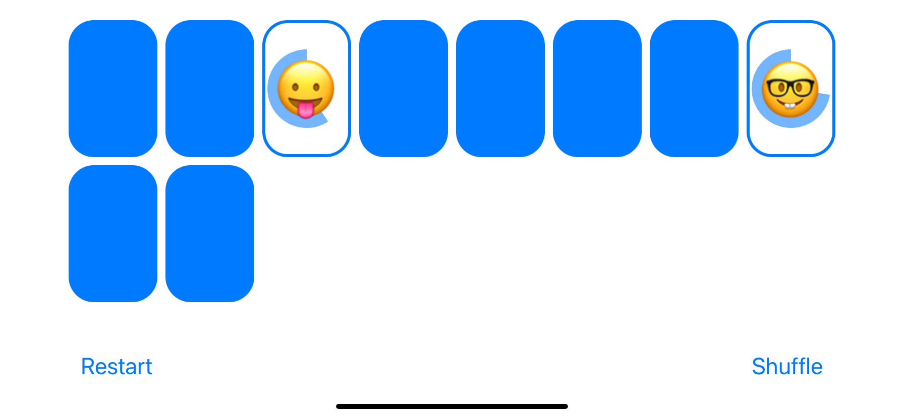

# Memorize
Memory card game for iOS/iPadOS App 

## Table of Contents
* [Description](#description)
* [Screenshot](#screenshot)
* [Code](#code)
* [Contact](#contact)
* [Technologies](#technologies)
* [Project Status](#project-status)

## Description 
This project was created using SwiftUI and is based on the lectures for Stanford University's CS193p.

## Screenshot

## Code
[GitHub Code Repository](https://github.com/Johny49/Memorize)

## Contact 
Created by [@johny49](https://github.com/Johny49/) - feel free to contact me!

## Technologies
- SwiftUI

## Project Status
Project is: functioning as intended; scoring may be implemented in the future.

